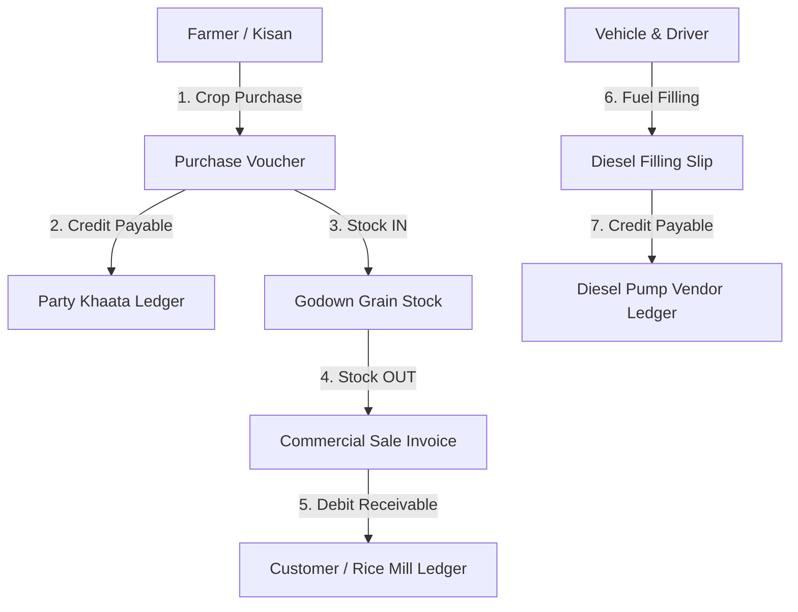

# 🌾 Nawaz Traders ERP — Complete Technical & UI Architecture Documentation

Welcome to the **Nawaz Traders ERP** developer & architectural documentation! This document serves as a complete walkthrough of the entire system—from UI design aesthetics and glassmorphism styling to backend services, calculations, and database schema relationships.

---

## 📌 1. Project Overview & Brand Identity

**Nawaz Traders ERP** is a full-stack Enterprise Resource Planning system tailored specifically for grain trading operations ( धान / Paddy, गेहूँ / Wheat, चना / Gram, सोयाबीन / Soyabean, सरसों / Mustard).

### 🎨 Brand Identity Guidelines
- **Primary Palette:** Forest Green (`#022c22` / `#064e3b`), Gold (`#f59e0b` / `#d97706`), Cream (`#fef3c7` / `#fffbeb`), Slate Dark (`#020617` / `#0f172a`).
- **Official Brand Tagline:** `GRAINS TODAY • A STRONGER TOMORROW`
- **Location:** Krishi Upaj Mandi, Sehore (M.P.) - 466001

---

## 🛠️ 2. Tech Stack & Architecture

| Tier | Technology | Purpose & Rationale |
| :--- | :--- | :--- |
| **Framework** | Next.js 14 (App Router, JS) | Server-side Rendering (SSR), Server Actions, API routes, fast page navigation. |
| **State Management** | Redux Toolkit (`@reduxjs/toolkit`) + `react-redux` | Centralized global store (`lib/redux/store.js`), typed hooks, entity & UI slices (`uiSlice`, `farmersSlice`, `purchasesSlice`, `salesSlice`). |
| **Database** | PostgreSQL | Robust transactional ACID database for financial ledgers & stock movements. |
| **ORM** | Prisma ORM | Type-safe schema definition, multi-table transactions (`prisma.$transaction`), and migrations. |
| **Styling System** | TailwindCSS + Glassmorphism | Custom design tokens (`.glass-card`, `.glass-modal`), dark mode support (`next-themes`). |
| **Precision Math** | `decimal.js` & Postgres `Decimal` | Guarantees zero floating-point rounding errors in weight conversions (KG <-> Quintal <-> Tonne) and currency totals. |

---

## 🎨 3. Design System & UI/UX Standards

### A. Dynamic Glassmorphism (`app/globals.css`)
- **`glass-card`**: Translucent container card with `backdrop-blur-md` blur and soft borders.
- **`glass-modal`**: High-blur modal dialog container for interactive forms.
- **Standardized Form Fields**:
  - `.app-input`: Clean input field with inner shadow, hover state, and emerald focus ring.
  - `.app-select`: Custom dropdown select control.
  - `.app-label`: Upper-case bold labels with Lucide inline icons.

### B. Navbar & Layout (`components/layout/Navbar.jsx`)
- **Zero-Layout Shift**: Navigation buttons retain fixed font weight and layout boundaries, eliminating screen vibration/shaking.
- **Brand Assets**: Integrates official brand logos (`/images/nawaz-traders-primary.png` for light mode, `nawaz-traders-dark.png` for dark mode, `nawaz-traders-icon.png` for mobile header).
- **Responsive Mobile Navigation**: Dedicated mobile drawer and bottom quick-nav bar (`Home`, `Farmers`, `Parties`, `Staff`, `Vehicles`).

### C. Print-Perfect Tax Invoices (`@media print`)
- Custom CSS print media rules automatically suppress header navbars, mobile footers, action buttons, and URL page footers when executing `window.print()`.
- Generates clean, A4-formatted, official printouts for **Sale Tax Invoices** and **Crop Purchase Slips**.

---

## 🗄️ 4. Modules & Data Flow



---

## 📦 5. Core Feature Modules Breakdown

### 🚛 Module 1: Vehicles & Diesel Management (`/vehicles` & `/vehicles/[id]`)
- **Database Models:** `Vehicle`, `FuelExpense`
- **Features:**
  - **Fleet Directory:** Register Tractors, 6-Wheeler/10-Wheeler Trucks, Trailers, and Pickups with starting odometer KM and driver assignments.
  - **Diesel Filling Slips (डीजल पर्ची):** Fuel filling log modal featuring live `Liters × Rate/Ltr` auto-calculation.
  - **Vendor Ledger Integration:** Selecting a Diesel Pump Vendor automatically records a credit entry in `PartyLedger` for accurate financial balances.

---

### 🏛️ Module 2: Warehouse & Stock Inventory (`/godowns` & `/godowns/[id]`)
- **Database Models:** `Godown`, `StockMovement`
- **Features:**
  - **Live Stock Aggregation:** Computes live grain quantities stored across warehouses in **Quintals (QTL)** and **Metric Tonnes (MT)**.
  - **Capacity Utilization:** Visual progress indicators reflecting space occupancy vs maximum storage capacity.
  - **Stock Movement History:** Immutable log tracking stock inflows (`PURCHASE_IN`) and outflows (`SALE_OUT`).

---

### 🛒 Module 3: Procurement & Crop Purchases (`/purchases` & `/purchases/[id]`)
- **Database Models:** `Purchase`, `PurchaseItem`, `PartyLedger`, `StockMovement`
- **Features:**
  - **Procurement Voucher Modal (`PurchaseFormModal.jsx`):**
    - **Palledari / Labour Pay Calculator:** Mode options for *Per Bag (प्रति बोरी)*, *Per Quintal (प्रति क्विंटल)*, or *Fixed Rate*.
    - **Inline Crop Registration:** Add new grain commodities directly within the procurement flow.
    - **Settlement Tracking:** Tracks advance payments and promised payment settlement dates.
  - **Printable Vouchers (`/purchases/[id]`):** Forest Green + Gold banner, itemized weighment details, Palledari breakdown, and signature blocks.

---

### 📈 Module 4: Commercial Grain Sales (`/sales` & `/sales/[id]`)
- **Database Models:** `Sale`, `SaleItem`, `PartyLedger`, `StockMovement`
- **Features:**
  - **Commercial Sales Modal (`SaleFormModal.jsx`):** Dispatches grain to Rice Mills & Commercial Buyers.
  - **Automated Stock & Ledger Posting:**
    1. Deducts grain stock (`SALE_OUT`) from the designated warehouse.
    2. Posts debit entry to customer's `PartyLedger` (increases receivables).
    3. Records payment collection if payment is received.
  - **Printable Commercial Tax Invoices (`/sales/[id]`):** Executive invoice layout with SBI bank transfer details, terms & conditions, and official seal placeholder.

---

## 📁 6. Folder Structure Reference

```text
d:\ERP/
├── app/                          # Next.js 14 App Router
│   ├── (auth)/                   # Authentication pages (login, signup)
│   ├── api/                      # REST API routes
│   │   ├── godowns/              # Warehouse endpoints
│   │   ├── purchases/            # Procurement endpoints
│   │   ├── sales/                # Commercial sales endpoints
│   │   ├── vehicles/             # Fleet endpoints
│   │   └── fuel-expenses/        # Diesel slip endpoints
│   ├── godowns/                  # Godown pages (/godowns, /godowns/[id])
│   ├── purchases/                # Purchase pages (/purchases, /purchases/[id])
│   ├── sales/                    # Sales pages (/sales, /sales/[id])
│   ├── vehicles/                 # Fleet pages (/vehicles, /vehicles/[id])
│   ├── globals.css               # Design system tokens & print styles
│   ├── layout.jsx                # Root app layout
│   └── page.jsx                  # Main Dashboard page
├── components/                   # React Components
│   ├── godowns/                  # Godown modals & UI components
│   ├── purchases/                # Purchase modals & UI components
│   ├── sales/                    # Sales modals & UI components
│   ├── vehicles/                 # Vehicle & Fuel modals
│   ├── farmers/                  # Farmer modals & vouchers
│   └── layout/                   # Navbar & Footer components
├── server/                       # Backend Logic & Business Services
│   ├── services/
│   │   ├── purchaseService.js    # DB transaction logic for purchases
│   │   ├── saleService.js        # DB transaction logic for sales
│   │   └── partyService.js       # Party & ledger services
├── lib/                          # Helper Libraries & Utilities
│   ├── db/prisma.js              # Prisma Client singleton
│   ├── calculations/unitConverter.js # Precision Unit Conversion (KG/QTL/TON)
│   └── utils.js                  # Currency formatters & class names
├── prisma/
│   └── schema.prisma             # PostgreSQL Database Schema
├── public/images/                # Brand Logo assets & Tagline guides
├── PROJECT_DOCUMENTATION.md      # Full Technical Documentation (This file)
└── README.md                     # Quickstart Guide
```

---

## 🚀 7. Developer Quickstart

To run this project locally:

```bash
# 1. Install Dependencies
npm install

# 2. Push Prisma Schema to PostgreSQL
npx prisma db push

# 3. Seed Master Data (Admin, Commodities, Units, Godowns)
node prisma/seed.js

# 4. Start Next.js Dev Server
npm run dev
```

Open `http://localhost:3000` in your browser to access the ERP.
